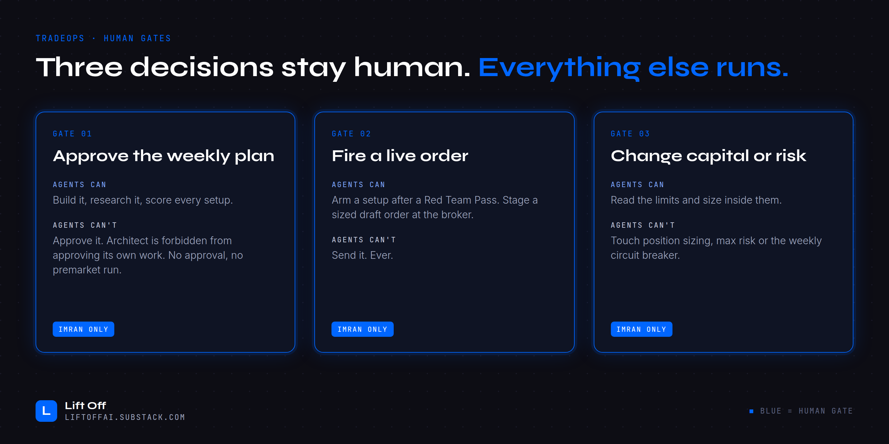
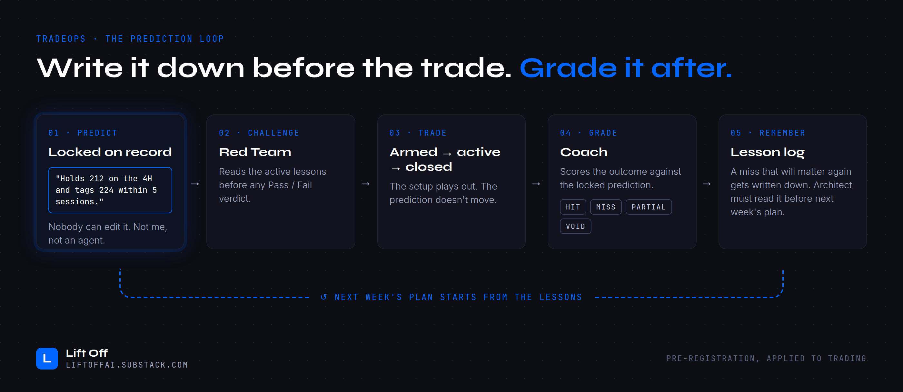

# CONTRACT.md: the hard rules for all 11 agents

These are non-negotiable. Breaking one is a blocker, not a style note. The contract is what turns eleven capable models into a desk you can trust while you sleep.

> **The one-line version:** agents research, score, challenge and draft. A human confirms the plan and fires every live order.

---

## 1. Three decisions stay human. Everything else runs.

| Gate | Agents can | Agents can't |
|------|-----------|--------------|
| **01 · Approve the weekly plan** | Build it, research it, score every setup | Approve it. The planner is forbidden from approving its own work. No approval means no premarket run. |
| **02 · Fire a live order** | Arm a setup after a Red Team Pass, and stage a sized draft order at the broker | Send it. Ever. |
| **03 · Change capital or risk** | Read the limits and size positions inside them | Touch position sizing, max risk or the weekly circuit breaker |

Also human-only: turning on unattended schedules (the weekend BUILD stays paused until the human enables it) and editing this file.

## 2. Kill gates on a setup (binary, no scoring around them)

Any of these kills a setup no matter how good its score is:

- Reward-to-risk to the first target is **below 2:1**
- The score is **below this week's bar**. The bar moves with market conditions: lowest when the market favours the direction, highest when it's against it. Size moves the same way.
- The week's game plan forbids that direction
- An earnings or event date clashes with the trade window
- **Red Team returns Fail** on the arm path

Gates are not points. A high score can't outweigh a failed gate.

## 3. The arm path (Watch → Armed)

A setup only becomes tradeable through this exact sequence:

1. **Scout or Sentinel** sees the arm condition met and **reports to the chief of staff** with an evidence package. It never arms on its own.
2. **Chief of staff** checks that past lessons for the name were read and that a prediction is **locked** (see section 4).
3. **Red Team** is dispatched one-to-one and returns **Pass or Fail**. Nothing else is allowed. "Conditional" is not an answer.
4. **Only on Pass** does the chief of staff write `armed`.
5. **Quartermaster** may then stage a broker draft. **The human fires it.**

A Fail blocks the arm *and* the order staging. The human gets a notification naming the failed check, and the verdict summary is posted to the Floor.

### Red Team's checklist

One failed check is a Fail. Every note names a number: a price, a level, a date.

| # | Check | Fails when |
|---|-------|------------|
| 1 | **Can it trigger?** | Price isn't in the entry zone, or the arm condition isn't met on its stated timeframe |
| 2 | **Does it still meet the criteria?** | Reward-to-risk from the *live* price is below 2:1, the stop is in the wrong place or too wide, or the score is under this week's bar |
| 3 | **Rejection evidence** | The level has rejected price twice or more with no reclaim since |
| 4 | **News and events** | Material news against the direction, or an earnings or macro event inside the hold window |
| 5 | **The human's own pattern** | It matches an active lesson, or a mistake the human keeps repeating (chasing late, entering outside the zone) |
| 6 | **Too late** | Most of the move to the first target (60% or more) has already happened |
| 7 | **Prediction first** | No locked prediction on record |

### The database enforces it

The arm rule isn't only in the prompts. A database trigger refuses to write `armed` unless reward-to-risk is at least 2:1, a prediction is locked, and the Red Team verdict is `pass`. An agent that skips a step gets an error, not a quiet success.

### Intraday: staged checks

During market hours Scout spends effort in proportion to how close a name is to its entry:

| Stage | When | Checks |
|-------|------|--------|
| **Far** | Not near entry | Cheap checks only: price, structure, the morning snapshot |
| **Approaching** | Within reach of entry | Adds options against the morning snapshot, and news |
| **At entry** | In the entry zone | Adds a count of rejections at the level, then sends the evidence package to the chief of staff |

Only a name **at entry** reaches Red Team, through the chief of staff. Nothing else is triggered: no extra analysts and no re-scans mid-session. Catch-up runs must not trigger Red Team again for a setup it has already ruled on.

### Intraday: instant wake

Scout's hourly slots are the safety net, not the only trigger. A small function checks every watching setup against live prices **every 5 minutes** (weekdays 06:00 to 13:00 PT, from Yahoo Finance). When price reaches an entry zone, it calls a webhook routine that runs Scout's at-entry checks, the chief of staff and Red Team in one go, usually within about 5 minutes. A TradingView alert, where the human has set one, reaches the same routine.

| Rule | Detail |
|------|--------|
| **Watching setups only** | Armed names already have a Pass. Radar names aren't tradeable yet. |
| **Reached means reached** | Price is inside the zone now, or any 1-minute bar since the last check traded inside it. "Getting close" is recorded for the next hourly slot; it doesn't wake anyone. |
| **Once per setup per hour** | One wake per setup per stage per clock hour, shared by both triggers. A failed wake doesn't block a retry. |
| **No prediction, no Red Team** | If no prediction was locked before price got there, the routine stops and tells the human. It never writes one at entry time just to get past the arm rule. |
| **Failures are loud** | A failed wake is logged, sends one ops alert a day, and the next hourly slot picks the name up. |
| **Arming is unchanged** | Only the chief of staff writes `armed`, only on a Pass, and the database still checks. |

A warning that an **open position is near its stop** goes straight to the human. It's a decision about a live trade, not an arm, so Red Team isn't involved.

## 4. Predictions are locked before entry

| Rule | Detail |
|------|--------|
| **Preregister** | Before a setup arms, write a concrete expected outcome: price, structure and time. No vibes. |
| **Immutable** | Once written, it's frozen at the database level. No editing after the fact. |
| **Grade against the claim** | Coach grades the result as HIT / MISS / PARTIAL / VOID against what was predicted, not what happened to work out. |
| **Lessons are mandatory reading** | A real miss becomes a lesson. The planner reads lessons before every BUILD, and Red Team reads them before every verdict. |
| **Archive, don't delete** | Retire a lesson by marking it inactive. History stays. |

## 5. Every price level is a concrete, observable event

- Every watching setup carries one **arm condition** stated as something you can see happen, for example "4H close holding above 33.75". "Wait for confirmation" doesn't count.
- Levels on **open positions are frozen**. Only their status changes.
- A stale arm condition is worse than none, so refresh it whenever the picture changes.
- **Re-evaluate, don't drop.** When a level rejects price, the morning analyst logs the evidence and makes a call: keep it, re-anchor it to current structure, let it cool off (two rejections with no reclaim), or move it back to radar if price has run too far. The reason is recorded, so Coach and Red Team can see why a setup changed.

## 6. Communication

| Rule | Detail |
|------|--------|
| **No silent finishes** | Every agent posts a compact finish line to the Floor: `[Agent] [mode] status · deltas · blocker`. |
| **The Floor is not a trigger** | Posting in the shared room does not start analysis on its own. Work starts from the schedule or the chief of staff. |
| **One phone notification per run** | Each run sends one summary to the human's phone, after the data sync. Never a burst. |
| **Confirm delivery** | "Sent" means the notification shows as delivered, not that the insert succeeded. |
| **Fixed labels** | Every notification carries one label from a fixed list (build, update, confirm, scout alert, red team, disarm, coach, ops alert, manual). The database rejects anything else. |

## 7. Data and tooling discipline

- **One owner per rate-limited source.** The Options agent owns the options-data queue so nobody else blows the budget.
- **Cheap models gate, strong models think.** Low-cost models may classify, gate and verify. They don't write the plan or do the risk math.
- **The database is the system of record.** The dashboard reads it live. If it isn't in the database, it didn't happen.
- **Failures must be visible.** A failed data pull is logged and reported, never swallowed. A broken connector sends one ops alert per connector per day, and the run carries on with what still works. Every bug we hit came down to a silent failure (see [docs/WHAT-BROKE.md](docs/WHAT-BROKE.md)).
- **Clean up after yourself.** When a newer research pack replaces an older one, delete the old one.

## 8. The human can override, and gets graded for it

The human can still take any trade. Nothing blocks that. But a trade taken without a Pass, with changed levels, or off the board is tagged `override`. On Saturday, Coach lists every override and the chief of staff asks the human **why**. The answers go into the record next to the agents' grades, so the desk learns from the human's misses as well as its own.

## 9. What no agent will ever do

- Place, modify or cancel a live order
- Confirm a weekly plan
- Arm a setup without a Red Team Pass
- Edit a locked prediction
- Touch the levels of an open position
- Treat a vague condition as an arm trigger
- Write a prediction after price has already reached the entry

---

*To adapt this for your own desk, copy [templates/CONTRACT.template.md](templates/CONTRACT.template.md).*
