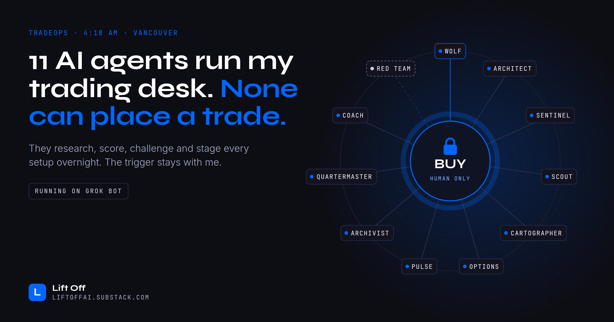
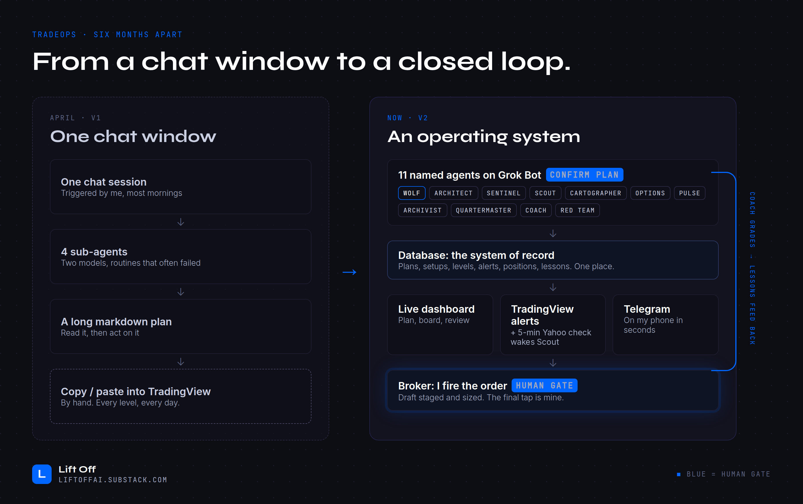
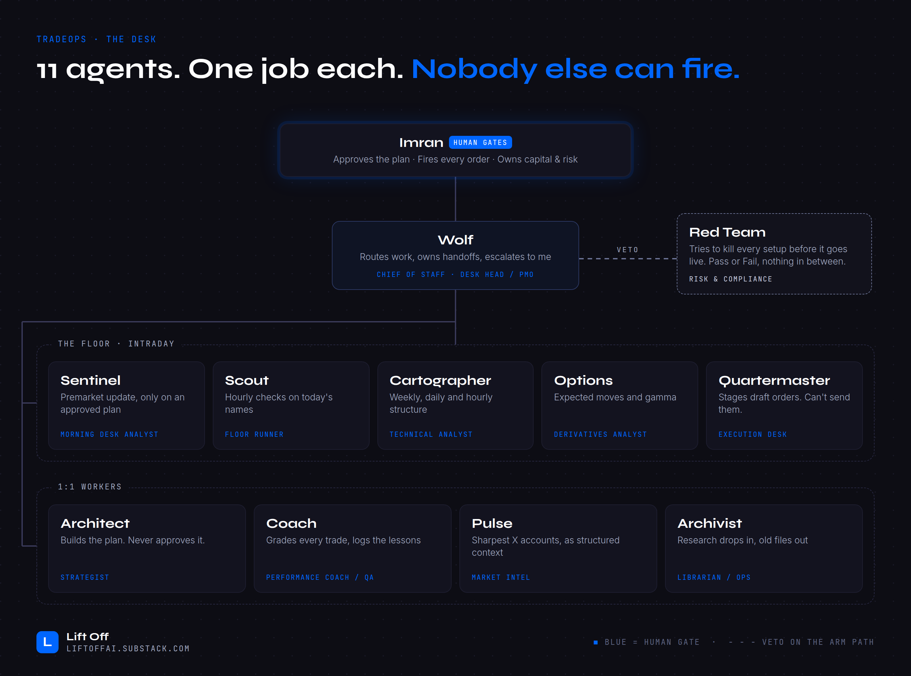
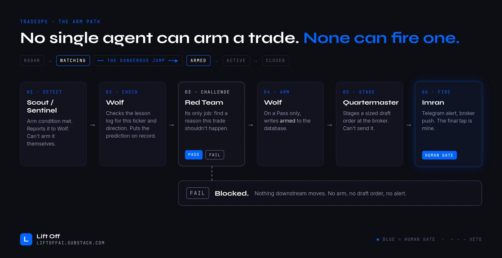
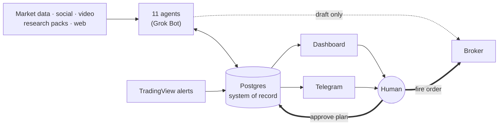

# TradeOps: an AI trading desk where no agent can place a trade

**11 AI agents run my trading desk overnight. None of them can place a trade.**

This is the public pack behind the Lift Off article [*I Gave 11 AI Agents My Trading Desk. None of Them Can Place a Trade.*](https://liftoffai.substack.com). It contains the agent roster, the hard rules every agent follows, and templates to build the same pattern for your own desk, trading or not.

> Not financial advice. Nothing here places trades. See [DISCLAIMER.md](DISCLAIMER.md).

---

## What's inside

| File | What it is |
|------|------------|
| [**ROSTER.md**](ROSTER.md) | The 11 agents: one job each, what each may and may not do, and a day on the desk |
| [**CONTRACT.md**](CONTRACT.md) | The hard rules: human gates, kill gates, the arm path, locked predictions |
| [**DESK-pack.pdf**](DESK-pack.pdf) | Both of the above on two shareable pages |
| [templates/](templates/) | Blank `CONTRACT`, `ROSTER` and agent-card templates to adapt |
| [docs/WHAT-BROKE.md](docs/WHAT-BROKE.md) | Six months of failures and the single pattern behind them |
| [docs/BEYOND-TRADING.md](docs/BEYOND-TRADING.md) | The same design mapped to due diligence, procurement, underwriting and more |
| [docs/ARCHITECTURE.md](docs/ARCHITECTURE.md) | How it's wired: system, planes, arm path, data model, setup lifecycle (Mermaid diagrams) |
| [docs/CONNECTORS.md](docs/CONNECTORS.md) | Every MCP connector and data source, who uses it, and how far it's trusted |
| [docs/CADENCE.md](docs/CADENCE.md) | Who runs when, from 03:35 PT to the weekend BUILD |
| [docs/PREDICTION-LOG.md](docs/PREDICTION-LOG.md) | How predictions are written, locked, graded and turned into lessons |
| [docs/FAQ.md](docs/FAQ.md) | Common questions, including "can I run it?" and "does it make money?" |
| [templates/schema.sql](templates/schema.sql) | Starter Postgres schema that enforces the contract in the database |
| [images/](images/) | The diagrams from the article |

## The idea in four pictures

**1. From a chat window to a closed loop.**

**2. An org chart, not a prompt.** One job per agent, and everything routes through a chief of staff.

**3. No single agent can arm a trade. None can fire one.** The most valuable agent is the one that says no.

**4. The prediction gets locked first.** Every trade is graded against what was said *before* entry, and misses become lessons the desk must read.

## How it's wired

Thick arrows are human-only. Full diagrams: [docs/ARCHITECTURE.md](docs/ARCHITECTURE.md). Every tool and source: [docs/CONNECTORS.md](docs/CONNECTORS.md).

## The principles

1. **Agents prepare, humans commit.** Three decisions stay human: approving the plan, firing an order, and changing capital or risk.
2. **One job per agent.** If an agent's card doesn't fit in five lines, split the agent.
3. **A dedicated "no" agent.** Red Team returns Pass or Fail, nothing in between, and a Fail stops everything downstream.
4. **Lock the prediction before acting.** Grade against the claim, not the outcome.
5. **Make failure loud.** Every bug in six months was a silent failure.

## Build your own

1. Copy [`templates/ROSTER.template.md`](templates/ROSTER.template.md) and name your agents.
2. Write one [`AGENT.template.md`](templates/AGENT.template.md) card per agent.
3. Fill in [`CONTRACT.template.md`](templates/CONTRACT.template.md). Start with the irreversible action and make it human-only.
4. Give every agent the contract as a standing instruction, and a database as the single system of record. [`templates/schema.sql`](templates/schema.sql) is a starting point that enforces the hard rules in the database.

The pattern is model- and platform-agnostic. TradeOps currently runs on Grok Bot, with a Postgres database, a live dashboard, TradingView alerts and Telegram notifications.

## What's not here

This is the operating design, not the private system. Plans, positions, levels, account data, credentials and internal identifiers are intentionally left out.

## Follow along

- Newsletter: **Lift Off** at [liftoffai.substack.com](https://liftoffai.substack.com)
- Author: Imran Chatur, Lift Consulting Ltd. (British Columbia, Canada)

## License

Docs, templates and images: [CC BY 4.0](LICENSE). Use and adapt freely with attribution to *Imran Chatur / Lift Off*.
