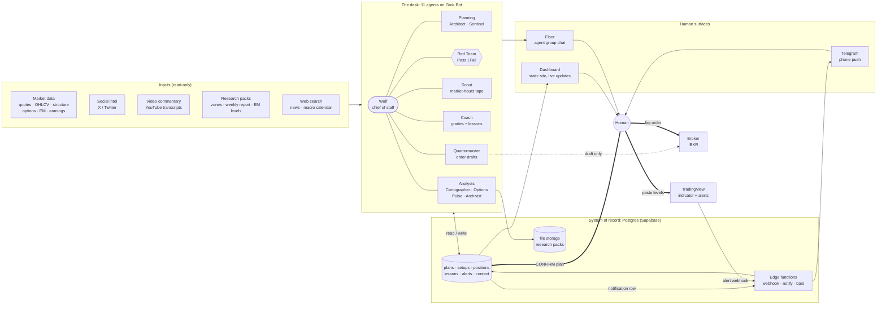
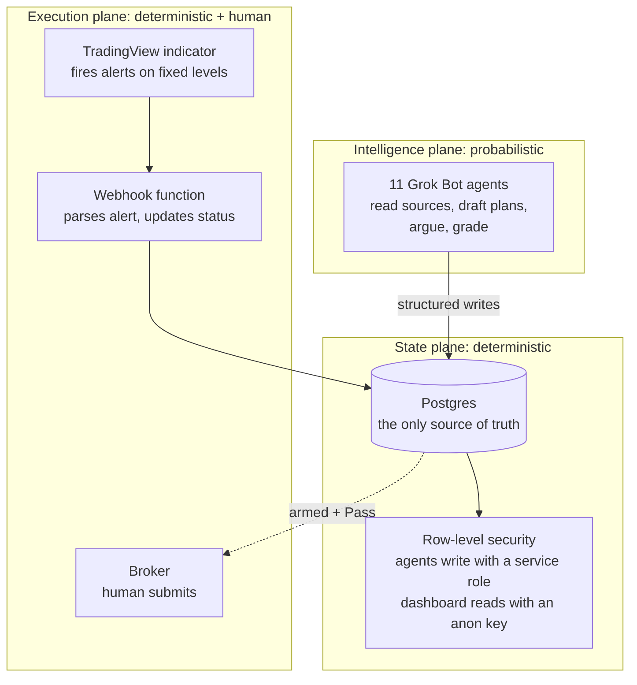
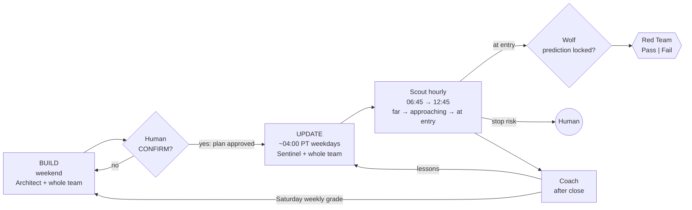
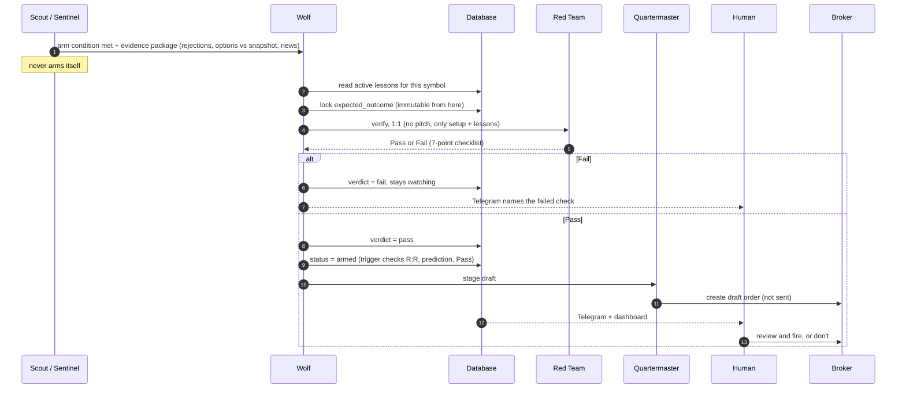
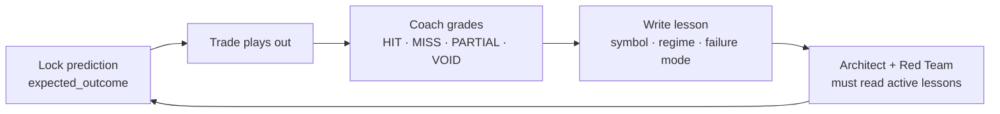
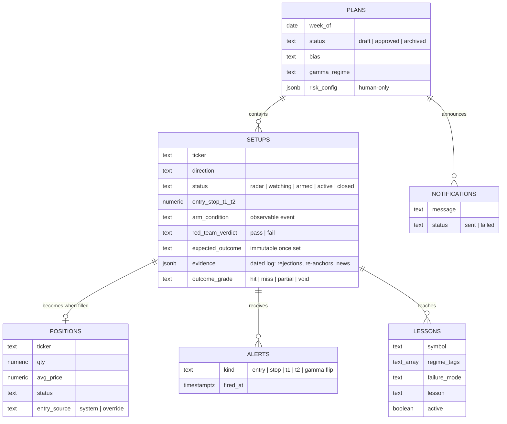
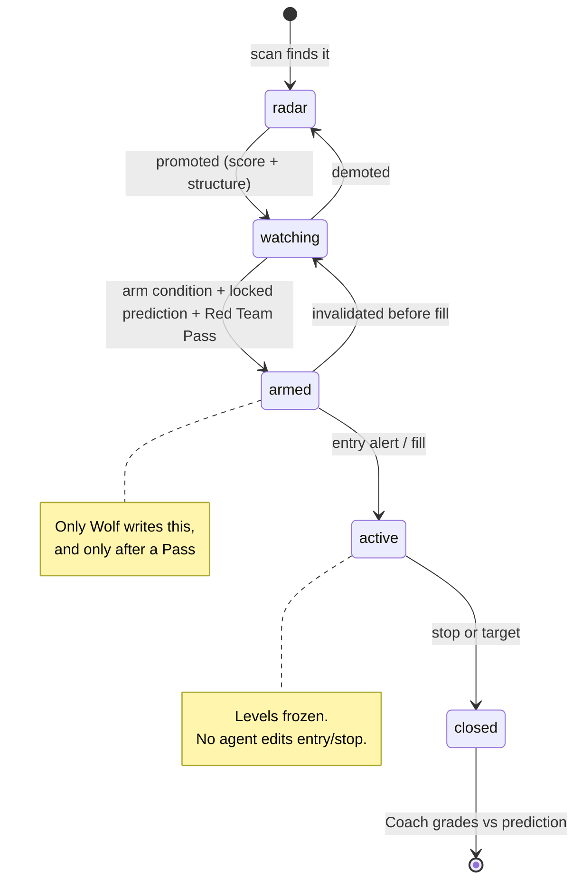

# Architecture

How TradeOps is wired: who thinks, where state lives, and where the human sits. Every diagram is [Mermaid](https://mermaid.js.org), so it renders on GitHub and you can copy it into your own docs.

The short version: **agents read and write a database. A dashboard and your phone read the database. A broker sits behind a human.**

---

## 1. System overview

**Read it like this:**

- Thin arrows are automated. **Thick arrows are human-only.** There are three, and they match the three human decisions in [CONTRACT.md](../CONTRACT.md).
- The dotted arrow is the closest any agent gets to money: Quartermaster can stage a *draft* order. It cannot send it.
- Agents never talk to the dashboard or the phone directly. They write a row, and the database does the rest. That gives one place to look when something goes wrong.

---

## 2. The three planes

TradeOps separates **thinking**, **state** and **execution**, so a failure in one does not leak into the others.

| Plane | What lives there | Can it be wrong? | What stops it |
|-------|------------------|------------------|---------------|
| Intelligence | Agents, prompts, skills | Yes, often | Red Team, kill gates, the human CONFIRM |
| State | Tables, constraints, triggers | Only if the schema is wrong | Check constraints, immutability triggers, guards on deleting live rows |
| Execution | Price alerts, webhook, broker | Only on bad levels | Levels are pasted by a human; orders are fired by a human |

The rule that falls out: **anything that has to be exactly right (maths, status changes, money) is code or a constraint, never a prompt.**

---

## 3. A week on the desk

The full schedule is in [CADENCE.md](CADENCE.md).

---

## 4. The arm path

The most important sequence in the system. A setup goes from *watching* to *armed* only through this path, and nobody can skip a step.

Two details that matter:

1. **The prediction is locked at step 3, before Red Team sees anything.** A database trigger rejects any later edit, so the grade at the end is against what was actually claimed.
2. **Red Team gets the setup, the evidence and the lessons, not the argument for it.** It judges the trade fresh.
3. **The database has the last word.** The `armed` write fails unless reward-to-risk is at least 2:1, the prediction is locked and the verdict is `pass`.

---

## 5. The prediction loop

Details and the record format: [PREDICTION-LOG.md](PREDICTION-LOG.md).

---

## 6. Data model (simplified)

The tables an agent touches. Column names are simplified; the point is the shape.

---

## 7. Setup lifecycle

---

## 8. Design choices worth stealing

| Choice | Why |
|--------|-----|
| **One database is the only source of truth** | Agents disagree. Rows don't. Every agent reads the same state and every failure has one place to look. |
| **Notifications are rows, not API calls** | An agent inserts a row; a trigger sends the Telegram message and writes back `sent` or `failed`. Agents need no phone credentials, and a missing message is visible. |
| **Deterministic execution, probabilistic analysis** | Price alerts fire from an indicator on fixed levels. The model never decides *when* a level is hit. |
| **Least-privilege connectors** | The broker connector can draft but not send. The dashboard key can read but not write. See [CONNECTORS.md](CONNECTORS.md). |
| **The human is graded too** | Trades taken outside a Pass are tagged `override`. Coach lists them and the human answers "why" every Saturday. |
| **Every finish posts a line** | Silent failure was the root cause of every bug in six months ([WHAT-BROKE.md](WHAT-BROKE.md)). Now every agent run ends with a status line in the group chat. |
| **Deploys are git pushes** | The dashboard is a static site. No agent can deploy it. |
