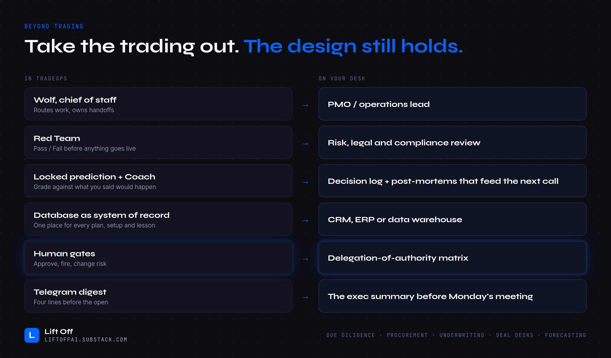

# Beyond trading: take the trading out and the design still holds

| In TradeOps | On your desk |
|-------------|--------------|
| **Wolf, chief of staff**: routes work, owns handoffs | PMO / operations lead |
| **Red Team**: Pass/Fail before anything goes live | Risk, legal and compliance review |
| **Locked prediction + Coach**: grade against what you said would happen | Decision log, plus post-mortems that feed the next call |
| **Database as system of record**: one place for every plan, setup and lesson | CRM, ERP or data warehouse |
| **Human gates**: approve, fire, change risk | Delegation-of-authority matrix |
| **Telegram digest**: four lines before the open | The exec summary before Monday's meeting |

It works anywhere the hard part is combining lots of data *and* sticking to a process: due diligence, procurement, underwriting, deal desks, forecasting.
