# Cadence: who runs when

All times Pacific. The US market opens at 06:30 PT.

```mermaid
gantt
    title A weekday on the desk (PT)
    dateFormat HH:mm
    axisFormat %H:%M
    section Overnight intel
    Video ingest (YouTube transcripts)      :a1, 03:35, 5m
    Archivist (research packs, Discord)     :a2, 03:40, 15m
    section Premarket
    Sentinel UPDATE + Cartographer, Options, Pulse :b1, 04:00, 60m
    Telegram digest + dashboard live        :milestone, b2, 05:00, 0m
    section Market hours
    Market open                             :milestone, c0, 06:30, 0m
    Scout staged checks                     :c1, 06:45, 10m
    Scout staged checks                     :c2, 07:45, 10m
    Scout staged checks                     :c3, 08:45, 10m
    Scout staged checks                     :c4, 09:45, 10m
    Scout staged checks                     :c5, 10:45, 10m
    Scout staged checks                     :c6, 11:45, 10m
    Scout staged checks                     :c7, 12:45, 10m
    Market close                            :milestone, c9, 13:00, 0m
    section After close
    Coach EOD grade + lessons               :d1, 13:00, 30m
```

## Weekday

| Time (PT) | Who | What | Gate |
|-----------|-----|------|------|
| ~03:35 | Video-ingest routine | New videos from a short channel list → transcripts table | None. Empty is fine. |
| ~03:40 | Archivist | Research packs from community channels → file storage + week context | None. Empty channels are fine; no escalation. |
| ~04:00 | Sentinel, with Cartographer, Options, Pulse | **Full** premarket UPDATE: options, structure, charts, zones, video and social intel. Clear entry / stop / T1 / T2 on every watching setup. Re-checks each one (keep, re-anchor, cool off, or radar) and saves a premarket options snapshot for Scout to compare against. May add names. Watchlist + indicator paste blocks regenerated. One Telegram digest. | Runs only if the week's plan is **approved** by the human |
| 06:45 → 12:45 hourly | Scout | Staged checks: **far** (cheap checks), **approaching** (adds options vs the morning snapshot, and news), **at entry** (adds a rejection count). A name at entry goes to Wolf with its evidence; Wolf calls Red Team (Pass / Fail only). Stop-risk warnings go straight to the human. | Never arms. A catch-up run 7 minutes later fills gaps and dedupes. |
| Any time | TradingView indicator → webhook | ENTRY / STOP / T1 / T2 alerts update status and push to the phone | Deterministic, no model involved |
| ~13:00 | Coach | Grade the day against locked predictions. Write lessons. | Can't edit a locked prediction |

## Weekly

| When | Who | What |
|------|-----|------|
| Saturday ~09:00 | Coach | Weekly grade, execution patterns, lesson cleanup. Checks recorded trades against the broker and lists every override trade. |
| Saturday | Wolf → human | Asks "why" for each override. The answers go back to Coach. |
| Weekend | Archivist | Archives last week's files |
| Weekend | Architect + whole team | Reads last week from the database, archives it, then BUILDs next week's plan. Reads active lessons first. Score bar and size set by market condition. **Stops at draft.** |
| After review | **Human** | CONFIRM → plan approved → weekday routines start running |

## Rules of the cadence

- **Every run ends with one line on the Floor** (the agents' group chat): status and what changed. A run that finishes silently is treated as a failure.
- **Morning UPDATE is full intel, not a status pass.** If it only promoted and demoted names, it was under-scoped.
- **Intraday is narrow on purpose.** Scout watches predefined levels and spends effort only on names near entry. It never calls Red Team itself and doesn't pull in analysts mid-session, which keeps market-hours behaviour predictable.
- **Weekend BUILD can be paused.** Nothing runs on a plan the human hasn't approved.
