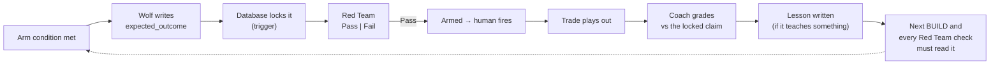

# The prediction log

The part of TradeOps most worth copying, and the rarest in other agent setups: **every trade's prediction is written down and locked before entry, then graded against what was actually said.**

Without it, an AI desk grades itself on outcomes. A winning trade "was right" even when it won for a reason nobody predicted, and a loser "was unlucky". Locking the claim first makes the grade honest. It's the same idea as pre-registration in science.

---

## The loop

## 1. Writing the prediction

A good `expected_outcome` is a claim someone else could grade without asking you what you meant.

| Field | Good | Bad |
|-------|------|-----|
| Price | "Holds 412 on 4H closes and tags 421 (T1)" | "Goes up" |
| Time | "within 3 sessions" | "soon" |
| Structure | "Makes a higher low above 405 before any push" | "Looks strong" |
| Invalidation | "A 4H close below 405 means the thesis is wrong" | "If it doesn't work" |

**Template:**

> If the thesis is right, **[symbol]** will **[observable price/structure event]** within **[time window]**. It is wrong if **[observable invalidation]** happens first.

## 2. Locking it

The lock is in the database, not in a prompt. Once `expected_outcome` is set, an update trigger rejects any change, from any agent or the human. See [`templates/schema.sql`](../templates/schema.sql), which also refuses to arm a setup without a Pass and a locked prediction.

## 3. Grading

Coach grades every closed setup against the claim, not the P&L.

| Grade | Meaning | Example |
|-------|---------|---------|
| **HIT** | The claim happened as stated, inside the window | Held 412, tagged 421 on day 2 |
| **PARTIAL** | Direction right; level, timing or path off | Held 412, stalled at 418, closed at T1 on day 5 |
| **MISS** | The invalidation happened first | 4H close below 405 on day 1 |
| **VOID** | The trade never got a fair test | Never filled, or a halt or news gap made the claim moot |

A profitable MISS is still a MISS. A losing HIT (right call, bad execution) sends the lesson to execution, not to the thesis.

**Override trades are graded too.** A trade the human took without a Pass is tagged `override`. Coach lists them on Saturday, the human answers why, and the answer is graded like any other claim. If the human keeps overriding the same way and losing, that becomes a lesson Red Team checks next time (check 5 in [CONTRACT.md](../CONTRACT.md) §3).

## 4. Writing the lesson

Not every grade needs a lesson. A lesson is written when a miss (or a lucky hit) teaches something that should change the next decision.

| Field | Example |
|-------|---------|
| `symbol` | `XYZ` |
| `direction` | `long` |
| `regime_tags` | `{risk-off, high-vix, post-cpi}` |
| `failure_mode` | `false_break` |
| `lesson` | "Breakouts above the weekly level failed twice in risk-off weeks. Require a 4H close and a retest hold, not the first push." |
| `source` | `coach` |
| `active` | `true` (archive with `false`, never delete) |

*Illustrative example, not a real trade.*

## 5. Using it

- **The planner reads active lessons before building next week's plan.** A setup that matches a lesson has to say how it's different this time.
- **Red Team reads active lessons before every Pass or Fail.** Lessons and the setup's own evidence log are the only history Red Team sees. It never sees the pitch.
- **Lessons are archived, not deleted,** so you can see what the desk used to believe.

## Why it matters outside trading

Swap "trade" for any decision an agent recommends:

| Desk | Locked prediction |
|------|-------------------|
| Due diligence | "Revenue concentration will be under 30% when the customer list arrives." |
| Procurement | "Supplier B will deliver within 10 days at the quoted price." |
| Underwriting | "This claim profile will settle under the reserve." |
| Hiring | "This candidate will pass the system-design round." |

Grade against it, write the lesson, make the next recommendation read it. More in [BEYOND-TRADING.md](BEYOND-TRADING.md).
