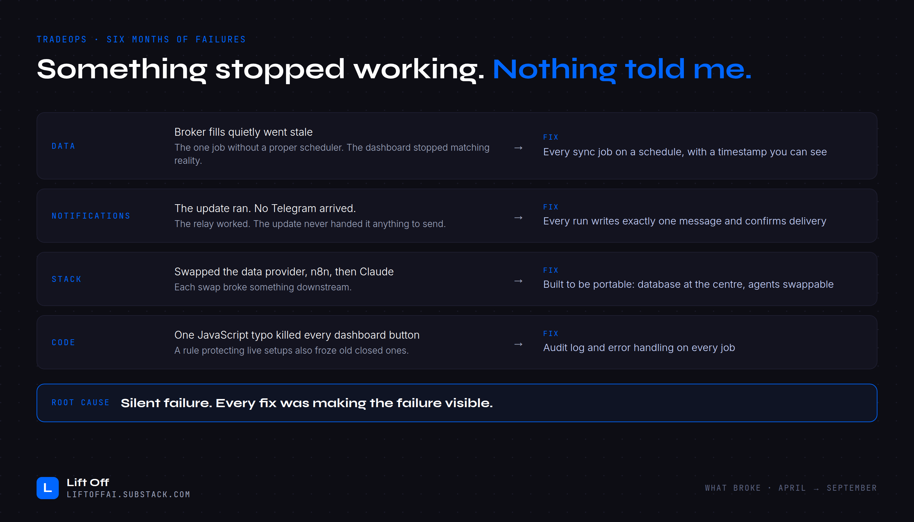

# What broke: six months of failures

| Area | What happened | Fix |
|------|---------------|-----|
| **Data** | Broker fills quietly went stale. It was the one job without a proper scheduler, and the dashboard stopped matching reality. | Every sync job runs on a schedule, with a timestamp you can see |
| **Notifications** | The update ran, but no Telegram arrived. The relay worked; the update never handed it anything to send. | Every run writes exactly one message and confirms delivery |
| **Stack** | I swapped the data provider, then n8n, then Claude. Each swap broke something downstream. | Built to be portable: database at the centre, agents swappable |
| **Code** | One JavaScript typo killed every dashboard button. A rule protecting live setups also froze old closed ones. | Audit log and error handling on every job |

**Root cause:** silent failure. Every fix made a failure visible.
